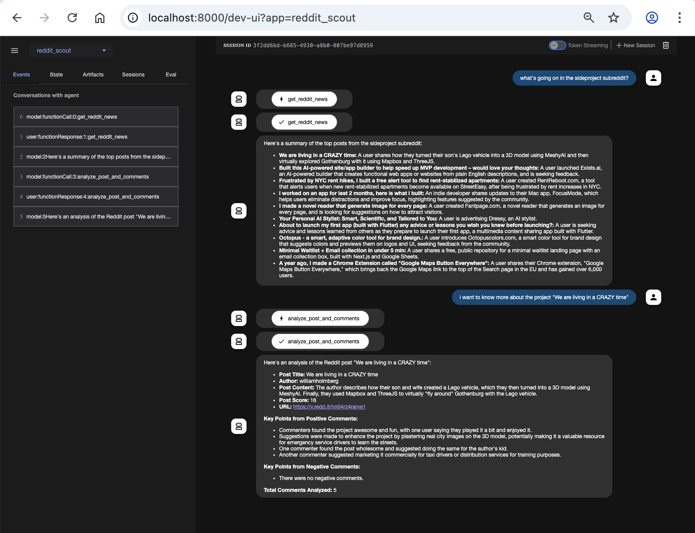

# Reddit Scout Agent

A Reddit scout agent built with Google's Agent Development Kit (ADK) that can fetch and analyze posts from any subreddit. The agent can provide both high-level summaries of top posts and detailed analysis of specific posts including their comments.

## Project Structure
```
agents/
└── reddit_scout/
    ├── __init__.py     # Package initialization
    └── agent.py        # Main agent implementation with Reddit interaction logic
```

## Features

- **Subreddit Post Fetching**: Retrieves top posts from any specified subreddit
- **Post Summarization**: Provides brief summaries of each post
- **Detailed Post Analysis**: 
  - Full post content and metadata
  - Author information
  - Post score
  - URL (if applicable)
  - Analysis of comments (positive/negative)
  - Comment statistics

## How It Works

The agent uses two main functions:

1. `get_reddit_news(subreddit, limit=10)`:
   - Fetches top posts from a specified subreddit
   - Returns post titles, content, and IDs
   - Used for initial post listing

2. `analyze_post_and_comments(subreddit, post_id, comment_limit=20)`:
   - Provides detailed analysis of a specific post
   - Analyzes post content and metadata
   - Categorizes comments as positive/negative based on score
   - Returns comprehensive post and comment analysis

## Setup

1. Clone the repository
2. Create a virtual environment:
   ```bash
   uv venv my_env
   source my_env/bin/activate  # On Unix/macOS
   # or
   .\my_env\Scripts\activate  # On Windows
   ```

3. Install dependencies:
   ```bash
   uv pip install -r requirements.txt
   ```

4. Set up Reddit API credentials:
   - Create a Reddit application at https://www.reddit.com/prefs/apps
   - Copy `.env.example` to `.env`
   - Fill in your Reddit API credentials in `.env`

## Usage

1. Navigate to the agents directory:
   ```bash
   cd agents
   ```

2. Run the agent:
   - For Command Line Interface:
     ```bash
     adk run reddit_scout
     ```
   - For Web UI:
     ```bash
     adk web
     ```

3. Interact with the agent:
   - Ask for latest posts: "What are the top posts in r/sideproject?"
   - Get detailed analysis: "Tell me more about [post title]"

## Example Interactions

```
User: "What are the top posts in r/python?"
Agent: [Lists top 10 posts with brief summaries]

User: "Tell me more about [specific post title]"
Agent: [Provides detailed analysis of the post and its comments]
```

## Environment Variables

Required environment variables are listed in `.env.example`. Make sure to set these up before running the agent.

## Error Handling

The agent handles various error cases:
- Missing API credentials
- Invalid subreddit names
- Private or banned subreddits
- API rate limiting
- Network errors

## Contributing

Feel free to submit issues and enhancement requests!

## Demo

Here's a demonstration of the Reddit Scout Agent in action:



The demo shows:
- Initial request for top posts from a subreddit
- Detailed analysis of a specific post including its content and comments
- The agent's ability to maintain context between requests
